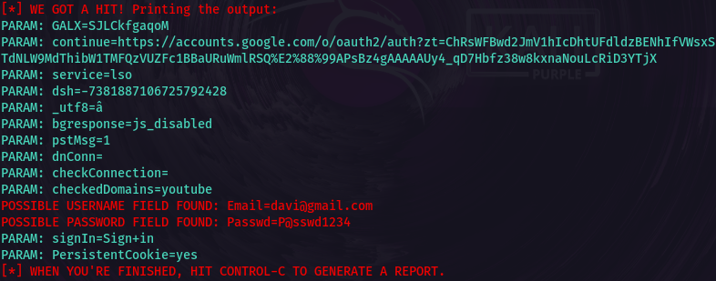
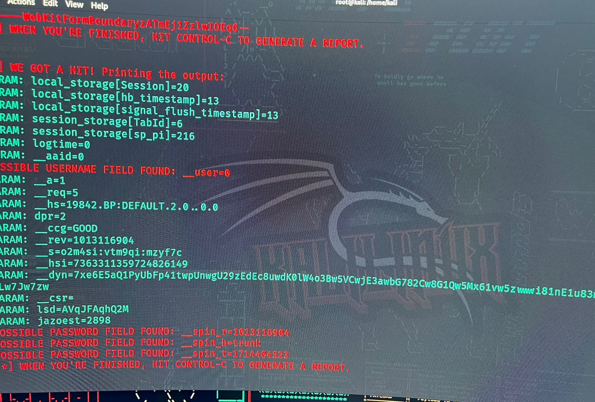

<h1 align="center">
    Ciber Security desafio phishing
</h1>

# Phishing para captura de senhas do Facebook

site utilizado para realizar o desafio

## Ferramentas utilizada

- Kali Linux
- setoolkit

## Configurando o phishing no Kali Linux

- Acesso root: ``` sudo su ```
- Iniciando o setoolkit: ``` setoolkit ```
- Tipo de ataque: ``` Social-Engineering Attacks ```
- Vetor de ataque: ``` Web Site Attack Vectors ```
- Método de ataque: ```Credential Harvester Attack Method ```
- Método de ataque: ``` Site Cloner ```
- Obtendo o endereço da máquina: ``` ifconfig ```
- URL para clone: http://www.facebook.com

## Resultados do professor



## Meu resultado

Professor, eu tentei de varias forma, capturar mas realmente não consegui, pesquisar na internet e pode ser vários fatores. Testei em varios navegadores, desabilitei o antivirus, tanto no normal quando no anonimo, e o resultado foi o mesmo que está na imagem.

Meu sistema operacional é Windows 11 Pro, maquina virtual Hyper-V, eu encontrei no web que poderia ser por causa da maquina virtual Hyper-V




## Informação

<a href="https://github.com/SilvaneiMartins">
    
    <br />
    <sub>
        <b>Silvanei de Almeida Martins</b>
    </sub>
</a>
     <a href="https://github.com/SilvaneiMartins" title="Silvanei martins" >
 </a>
<br />
🚀 Feito com ❤️ por Silvanei Martins