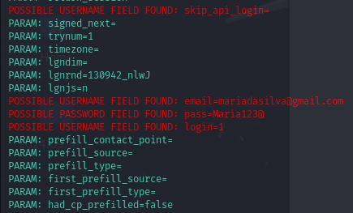

>Este desafio de projeto faz parte do conteúdo abordado pelo *Santander Bootcamp Cibersegurança*,
>realizado pela [DIO](https://web.dio.me/track/santander-bootcamp-ciberseguranca?tab=about)
>em parceria com o Santander Universidades.

# Simulação de Phishing para captura de senhas do Facebook

### Ferramentas utlizadas no labratório

- Kali Linux
- setoolkit

### Configurando o Phishing no Kali Linux

- Acesso root: ``` sudo su ```
- Iniciando o setoolkit: ``` setoolkit ```
- Tipo de ataque: ``` Social-Engineering Attacks [01]```
- Vetor de ataque: ``` Web Site Attack Vectors [02]```
- Método de ataque: ```Credential Harvester Attack Method [03]```
- Método de ataque: ``` Site Cloner[02] ```
- Obtendo o endereço da máquina: ``` ifconfig ```
- URL para clone: http://www.facebook.com

### Resutados


