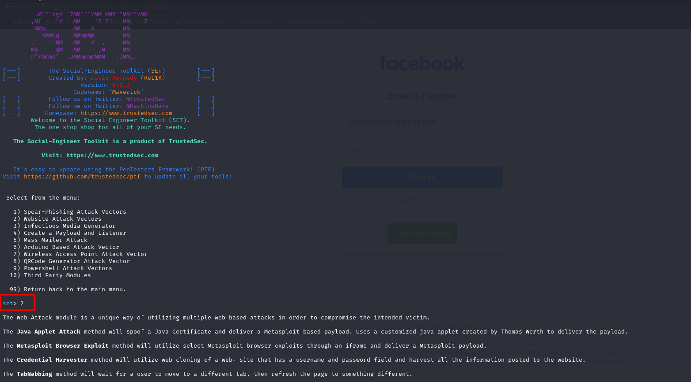
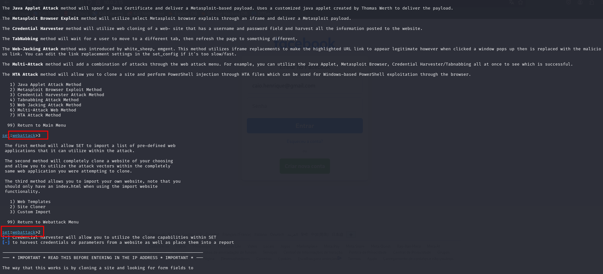
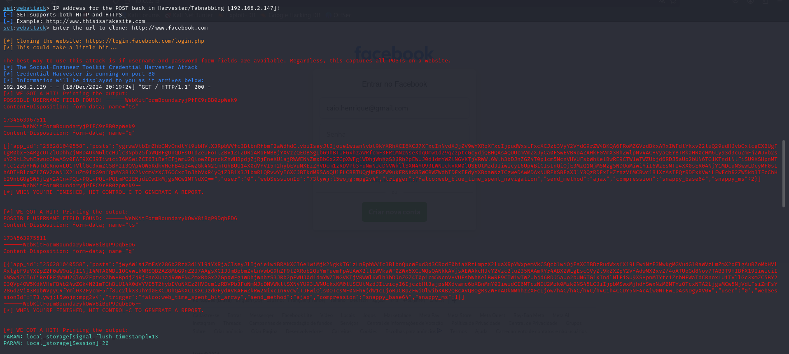
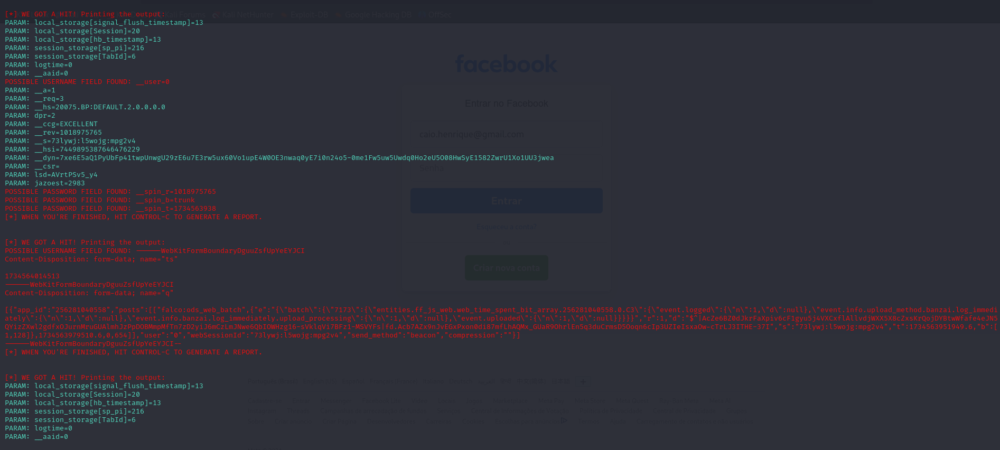
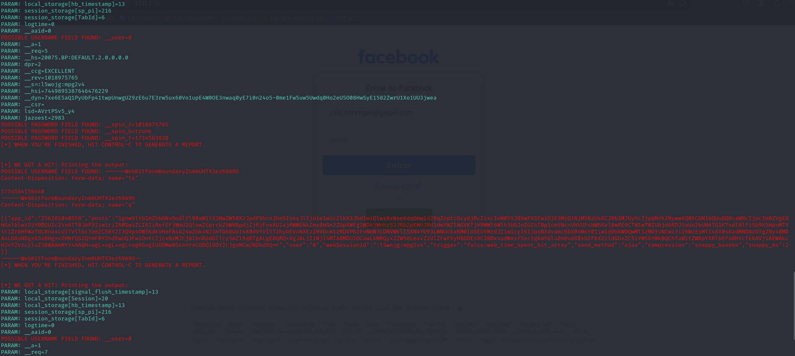
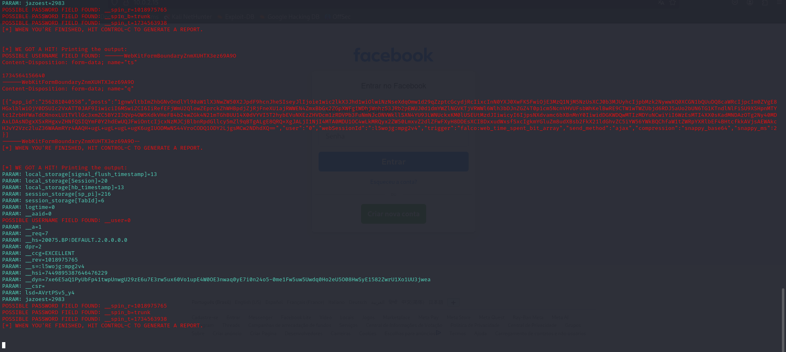

# Phishing para captura de senhas do Facebook

### Ferramentas

- Kali Linux
- setoolkit

### Configurando o Phishing no Kali Linux

- Acesso root: ``` sudo su ```
- Iniciando o setoolkit: ``` setoolkit ```
- Tipo de ataque: ``` Social-Engineering Attacks ```
- Vetor de ataque: ``` Web Site Attack Vectors ```
- Método de ataque: ```Credential Harvester Attack Method ```
- Método de ataque: ``` Site Cloner ```
- Obtendo o endereço da máquina: ``` ifconfig ```
- URL para clone: http://www.facebook.com

### Resutados

Executei os passos acima, porém a ferramenta não se comportou conforme no vídeo de orientações.
O site é clonado e consigo acesssar ele via rede, porém quando faço a autenticação o registro não imprime no log e também não é redirecionado.

Para que exista a evidência das ações realizadas seguem os logs:







